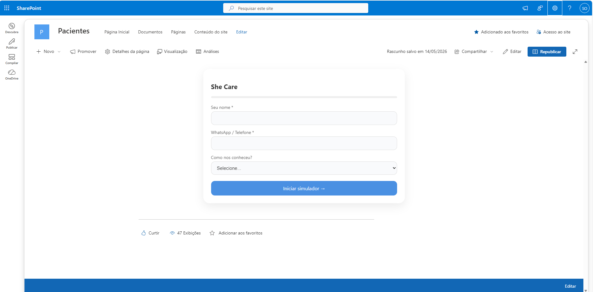

# Simulador Shecare SharePoint Framework
Esse simulador permite que o paciente responda algumas perguntas para fazer um processo prévio de anamnese.

# Cenário Atual
Anamnese era feita em papel e o cliente não tinha nenhum relatório baseado nesses dados.

# Cenário desejado
Criar um simulador que permitisse o paciente responder perguntas e os dados fossem armazenados no SharePoint para a analise dos dados.

# O que foi feito:
Foram criadas listas no Sharepoint para armazenar as informações e o projeto foi desenvolvido utilizando SharePoint Framework.

Figura 1: Foto da WebPart Shecare
